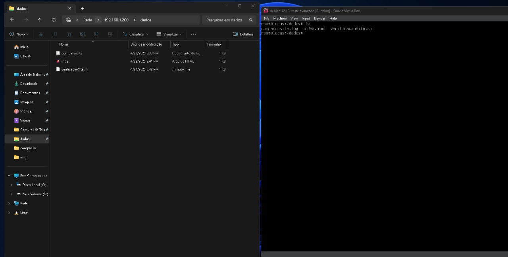
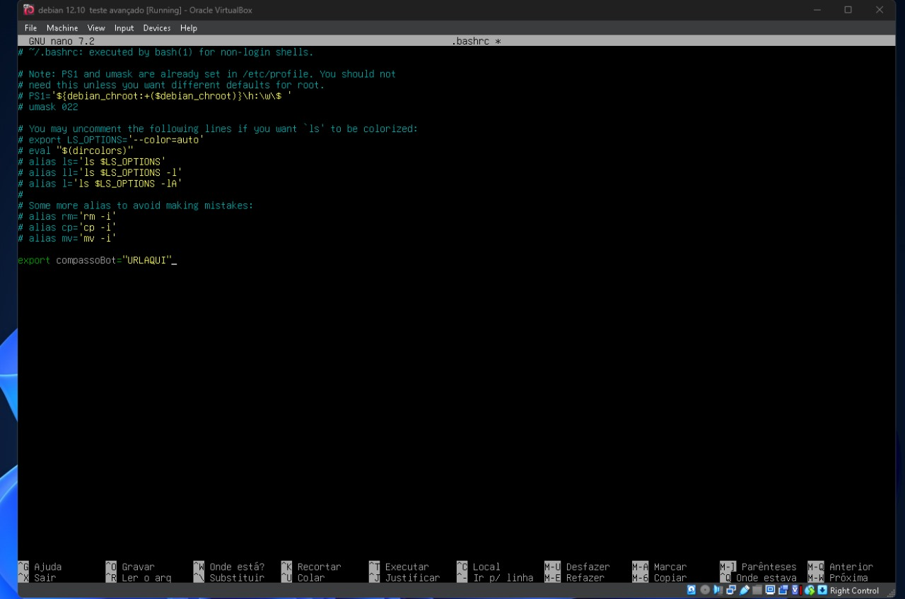
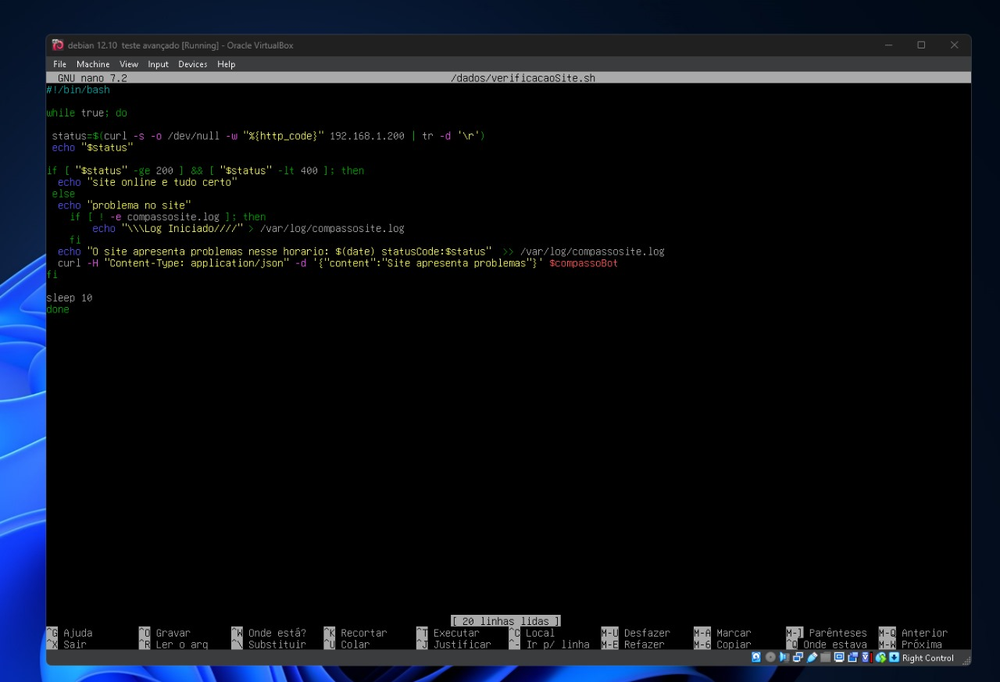
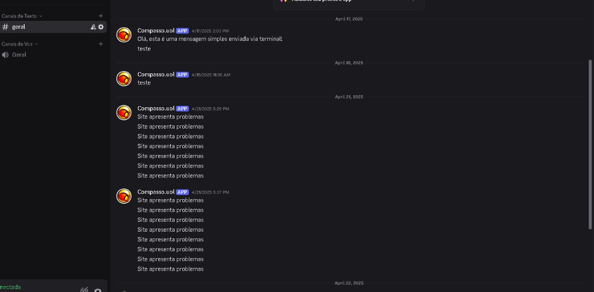
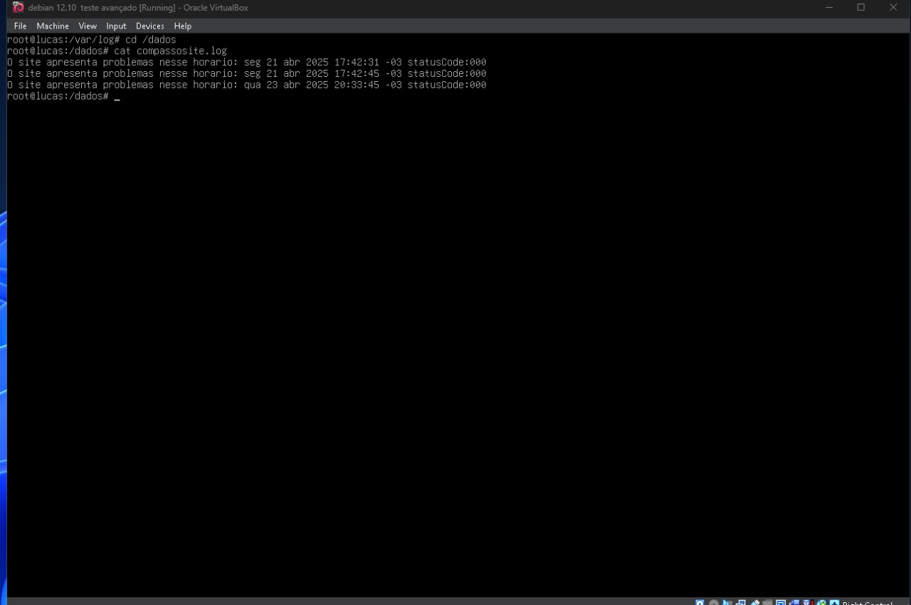

# - 📖 Projeto de Bolsas devepos/AWS,  Compass UOL, abril 2025 📖 -

## 📜 1 - Breve resumo 
        O projeto consiste em levantar, em algum ambiente Linux, uma página HTML simples com servidor Nginx, onde este é monitorado por um Script.
    
        Este Script é executado, e caso o servidor esteja fora do ar, retorna uma mensagem por meio de Webhook. Além disso, são armazenadas todas as informações coletadas pelo Script em um Log.
---
## 🐧 2 - Ambiente Linux e Discord 
        Utilizei em meu projeto uma Máquina Virtual, por meio do aplicativo Oracle VirtualBox. Criei a máquina com os requisitos mínimos para a utilização do Debian.

       Depois disso, criei um servidor no Discord e depois gerei a URL do webhook.

        Então, já dentro da VM, fiz a instalação dos pacotes que eu precisaria para a realização do projeto:
>`apt-get install nginx`  Para conseguir levantar o servidor da página web;  
>`apt-get install samba`  Para conseguir compartilhar arquivos da minha máquina windows com a VM;  
>`apt-get install curl` - Para verificar a conectividade da URL;
---
## 🖥️ 3 - Preparando o Sistema 
     Com o samba instalado usei para transferir os arquivos da minha maquina para a mv como o site web.
>`cd /`  Para ir até o diretório Root;  
>`mkdir dados`  Para criar a página que o Samba utilizará para comunicar as máquinas;  
>`chmod 777 dados`  Para dar permissões gerais de escrita, leitura e execução da pasta;  
>`nano /etc/samba/smb.conf`  e então configurei conforme a imagem:

        
        E por fim:
>`mv index.html //var/var/www/html` - Para então levar o arquivo html até a pasta onde o Nginx lê seus arquivos para o site;  

---
## #️⃣ 4 - Criando o Script 
>`cd /root`  Para ir para até o arquivo .bashrc;  
>`nano .bashrc`  Para editar o .bashrc;  

        A última linha serve para criar uma variável de ambiente.
>`curl -H "Content-Type: application/json" -d '{"content": "Site apresenta problemas"}' $BotNotf`  Cria uma mensagem em Json, com a mensagem especificada após `-d` para o link da nossa variável `$compassoBot`;

>`#!/bin/bash`  Serve para indicar o interpretador, nesse caso: Bash;   

>`while true; do` fiz um loop infinito para o script rodar até que eu encerre ele ou a maquina desligue.

>`status=$(curl -s -o /dev/null -w "%{http_code}" 192.168.1.200 | tr -d '\r')` O curl faz, silenciosamente e descartando o corpo no diretório `/dev/null`, a requisição do código http do servidor através da variável `URL`, e o escreve na variável `status`;  

>`if -> fi` Fiz essa condição para verificar se o status do servidor está entre 200 e 400, porque códigos como 201 (Created) ou 300 (Redirecionamento) também indicam que o servidor está funcionando normalmente. Assim, evito que o script retorne erro mesmo quando a resposta é válida.

> `if -> fi ` dentro do primeiro há uma segunda condicional para verificar se dentro do /var/log existe um arquivo compassoSite.log para botar o log, coloquei o ! para inverter a logica do -e. caso fosse verdadeiro ele iria iniciar o arquivo log caso fosse falso iria apenas gravar a mensagem de erro abaixo no echo.

> `Sleep` isso faz com que o script de um timer de 10 segundos até rodar denovo.

## ✅ 5 - Conclusão 

   

   

   Depois de alguns segundos que eu derrubei o servidor, ele me mandou a mensagem corretamente via Webhook, exatamente como esperado. Além disso, o script também gerou o log com o status no momento da falha, registrando tudo direitinho.

Gostei bastante de fazer esse projeto, principalmente porque consegui aprender e praticar conceitos importantes como Bash scripting, uso de Webhook no Discord e configuração do servidor Nginx no Linux. Com certeza me deixou mais confiante para automatizar tarefas e monitorar serviços em tempo real.

